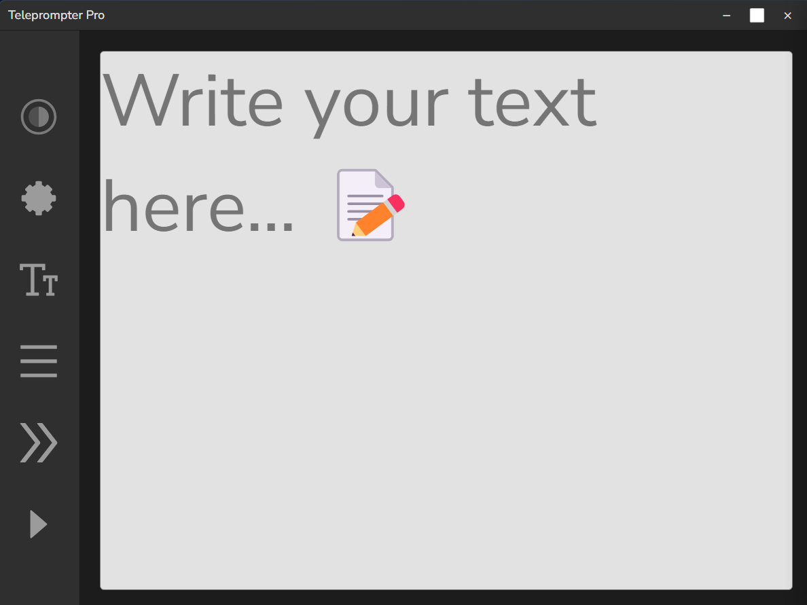
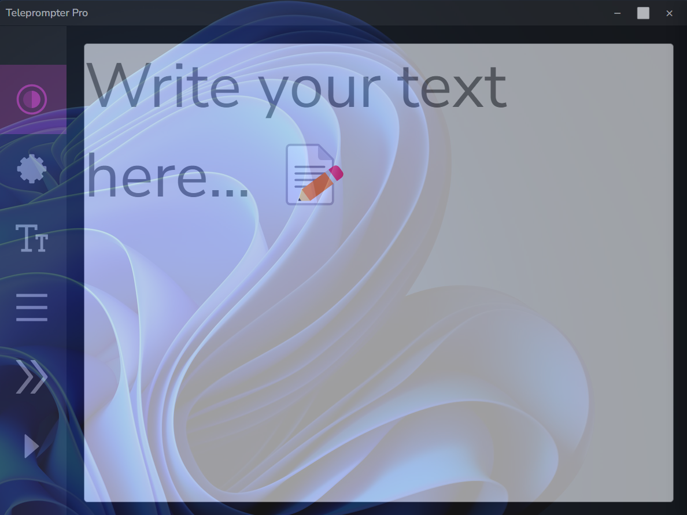
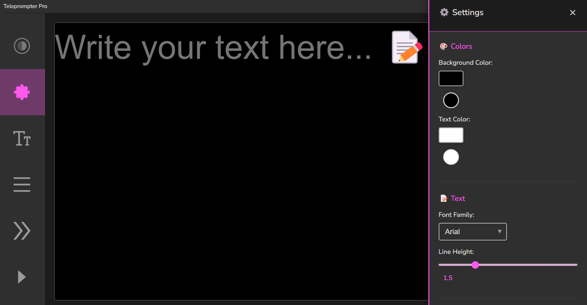

# 🎬 Teleprompter Pro - Invisible para Screen Share

Una aplicación de teleprompter de escritorio construida con Electron que tiene la característica especial de ser **invisible durante screen sharing** en videollamadas, perfecta para presentaciones y reuniones virtuales.

<p align="center">
  
</p>

<br>
<br>
<br>
<br>

-----

<p align="center">
  
</p>


<p align="center">
  
</p>

Transparency

<p align="center">
  
</p>


<p align="center">
  
</p>


## ✨ Características Principales

### 🔥 Funcionalidad Única

- **👻 Modo Invisible**: La ventana no aparece cuando compartes pantalla en videollamadas
  - **Método Principal**: `setContentProtection(true)` - API nativa de Electron
  - **Método de Respaldo**: PowerShell con `SetWindowDisplayAffinity` para máxima compatibilidad
- **📌 Siempre Encima**: Mantén el teleprompter visible sobre otras aplicaciones
- **🎭 Transparencia**: Ajusta la opacidad de la ventana para mayor discreción
- **📺 Modo Pantalla Completa**: Oculta controles para máxima visibilidad del texto

### 🎯 Controles del Teleprompter

- **⚡ Desplazamiento Automático**: Velocidad ajustable del texto
- **📝 Tamaño de Texto**: Desde 2rem hasta 50rem
- **📐 Alineación**: Izquierda, centro, derecha
- **🎨 Interfaz Moderna**: Diseño limpio y profesional

### ⌨️ Atajos de Teclado

- `Ctrl+Space`: Play/Pause del desplazamiento
- `Ctrl+I`: Alternar modo invisible
- `Ctrl+T`: Alternar siempre encima
- `Ctrl+Shift+T`: Alternar transparencia
- `F11`: Modo pantalla completa
- `Ctrl+Shift+P`: Mostrar/Ocultar ventana

## 🚀 Instalación

### Prerrequisitos

- Node.js (versión 16 o superior)
- npm o yarn

### Pasos de Instalación

1. **Clonar o descargar el proyecto**

```bash
cd teleprompter-main
```

2. **Instalar dependencias**

```bash
npm install
```

3. **Ejecutar en modo desarrollo**

```bash
npm start
```

### 🏗️ Construcción para Distribución

```bash
# Para Windows
npm run build-win

# Para macOS
npm run build-mac

# Para Linux
npm run build-linux

# Para todas las plataformas
npm run build
```

### Instalación recomendada y modo fácil para Windows

```bash
Set-ExecutionPolicy -ExecutionPolicy RemoteSigned -Scope CurrentUser
.\enable-symlinks.ps1
```

2. **Construir la aplicación**:

```bash
npm run build-win
```

### **Alternativa recomendada**, simplemente puede hacer doble clic en archivo "build.bat":

```bash
build.bat
```

---


## 🧪 Cómo Probar la Invisibilidad en Screen Share

### ✅ Método de Prueba Recomendado

1. **Preparación**:

   ```bash
   npm start
   ```


2. **Verificar en Videollamada**:
   - Abre Zoom, Teams, Google Meet, o Discord
   - Inicia screen sharing de "Pantalla completa" o "Ventana específica"
   - El teleprompter NO debe aparecer para los espectadores
   - Pero TÚ SÍ debes poder verlo normalmente

### 🔧 Solución de Problemas de Invisibilidad

**Si la ventana sigue siendo visible en screen share:**


1. **Verificar Compatibilidad**:

   - ✅ Windows 10/11: Funcionalidad completa
   - ⚠️ Windows 7/8: Limitada
   - ⚠️ macOS/Linux: Protección básica

2. **Verificar en Consola**:
   - Abre DevTools (`npm run dev`)
   - Busca mensajes como:
     - ✅ "SUCCESS_PROTECTION_APPLIED"
     - ❌ "FAILED*TO_APPLY_ERROR*\*"

### 🎯 Software de Videollamada Compatible

| Software            | Windows 10/11 | macOS | Linux | Notas                |
| ------------------- | ------------- | ----- | ----- | -------------------- |
| **Zoom**            | ✅            | ⚠️    | ⚠️    | Mejor compatibilidad |
| **Microsoft Teams** | ✅            | ⚠️    | ⚠️    | Excelente            |
| **Google Meet**     | ✅            | ⚠️    | ⚠️    | Muy bueno            |
| **Discord**         | ✅            | ⚠️    | ⚠️    | Bueno                |
| **Skype**           | ✅            | ⚠️    | ⚠️    | Bueno                |
| **OBS Studio**      | ✅            | ❌    | ❌    | Solo Windows         |

### 🚨 Importante

- En Windows, requiere permisos de PowerShell (se otorgan automáticamente)

### Configuración Básica

1. Abre la aplicación
2. Escribe o pega tu texto en el área principal
3. Ajusta el tamaño del texto con el control deslizante
4. Selecciona la alineación deseada
5. Configura la velocidad de desplazamiento

### Para Videollamadas

1. La aplicación será invisible para los espectadores pero visible para ti
2. Usa `Ctrl+Space` para controlar el play/pause durante la presentación

### Carga de Archivos

- Arrastra archivos `.txt` directamente al área de texto
- El contenido se cargará automáticamente

## 🛠️ Tecnologías Utilizadas

- **Electron**: Framework para aplicaciones de escritorio
- **HTML5/CSS3**: Interfaz de usuario
- **JavaScript ES6+**: Lógica de la aplicación
- **Node.js**: Entorno de ejecución

## 🔧 Configuración Avanzada

### Windows - Invisibilidad en Screen Share

La aplicación utiliza dos métodos para máxima compatibilidad:

1. **Método Principal**: `mainWindow.setContentProtection(true)` - API nativa de Electron

   - Más confiable y directo
   - Funciona con todas las versiones modernas de Electron
   - Compatible con Windows 10/11

2. **Método de Respaldo**: PowerShell con API `SetWindowDisplayAffinity`
   - Se activa automáticamente si el método principal falla
   - Utiliza el flag `WDA_EXCLUDEFROMCAPTURE (0x11)` de Windows
   - Máxima compatibilidad con sistemas antiguos

**Compatible con**:

- Zoom
- Microsoft Teams
- Google Meet
- Discord
- OBS Studio
- Y la mayoría de software de screen sharing

### macOS y Linux

En estos sistemas, la aplicación usa niveles de ventana especiales para minimizar su visibilidad durante screen sharing.


## 🐛 Solución de Problemas

### La ventana sigue siendo visible en screen share

- En Windows 10/11, verifica que tienes los permisos necesarios


### Error al instalar dependencias

```bash
# Limpiar caché y reinstalar
npm cache clean --force
rm -rf node_modules
npm install
```

### La aplicación no inicia

- Verifica que tienes Node.js instalado (`node --version`)
- Asegúrate de que todas las dependencias están instaladas
- Ejecuta en modo desarrollo: `npm run dev`

## 📝 Notas Importantes

- **Compatibilidad**: Funciona mejor en Windows 10/11 para la funcionalidad de invisibilidad
- **Rendimiento**: La aplicación es ligera y no afecta el rendimiento del sistema
- **Privacidad**: Todo el texto se mantiene local, no se envía a ningún servidor

## 🤝 Contribuir

1. Fork el proyecto
2. Crea una rama para tu función (`git checkout -b feature/AmazingFeature`)
3. Commit tus cambios (`git commit -m 'Add some AmazingFeature'`)
4. Push a la rama (`git push origin feature/AmazingFeature`)
5. Abre un Pull Request

## 📄 Licencia

Este proyecto está bajo la Licencia MIT. Ver el archivo `LICENSE` para más detalles.

## 👨 Basado en un proyecto

Basado en el proyecto original de [teleprompter project](https://github.com/meu-bem/teleprompter) , convertido a aplicación de escritorio con funcionalidades avanzadas para screen sharing.


---

## 👨‍💻 Autor

**Diego Ivan Perea Montealegre**

- GitHub: [@diegoperea20](https://github.com/diegoperea20)

----

Created by [Diego Ivan Perea Montealegre](https://github.com/diegoperea20)