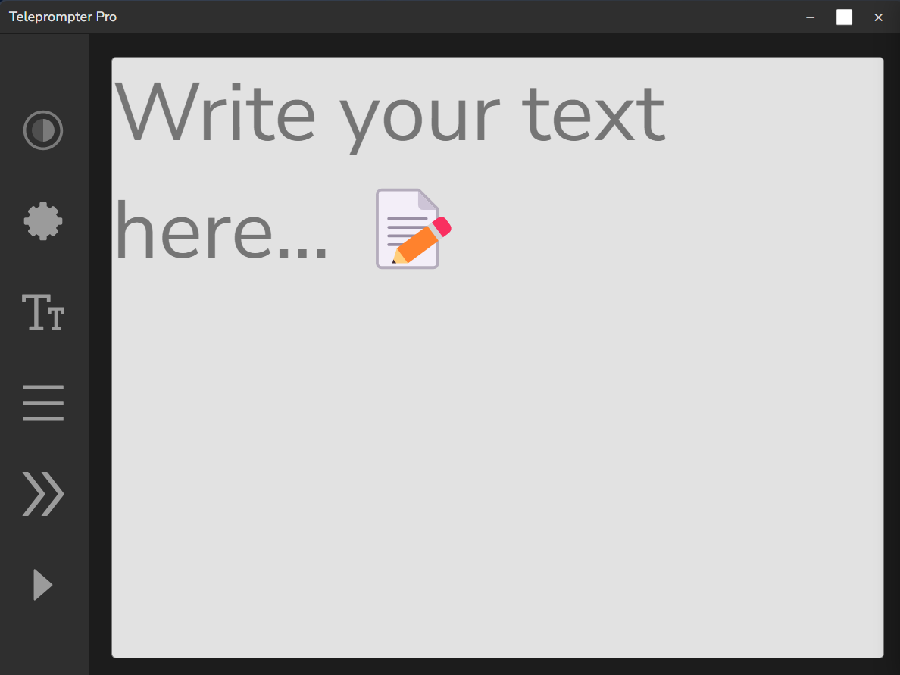
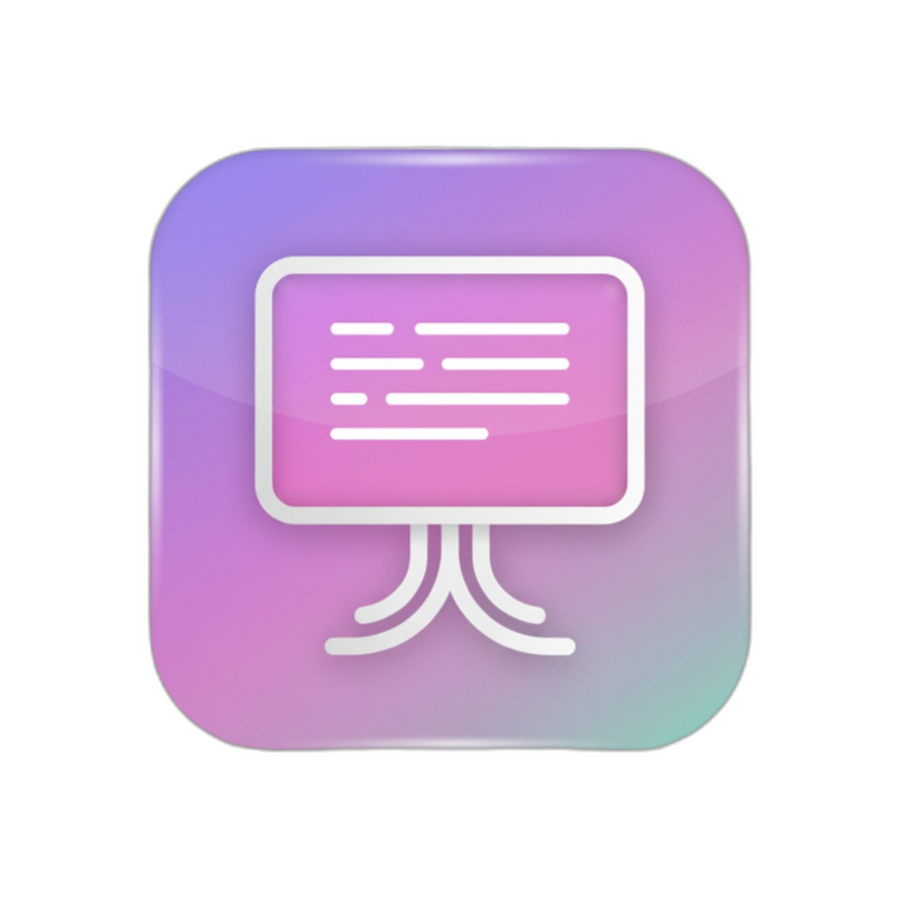
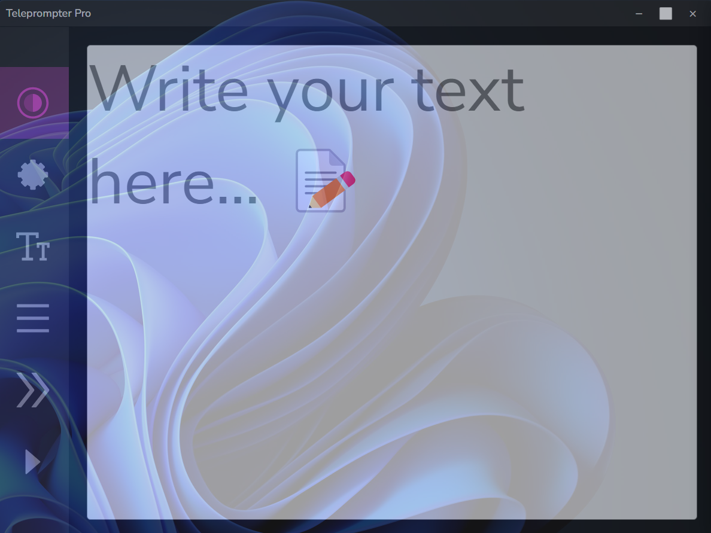
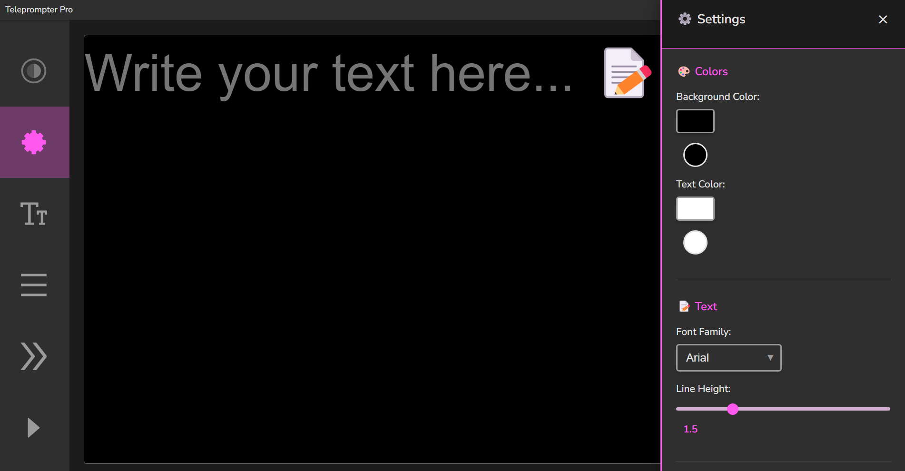

# 🎬 Teleprompter Pro - Invisible for Screen Share

A desktop teleprompter application built with Electron that has the special feature of being **invisible during screen sharing** in video calls, perfect for presentations and virtual meetings.

<p align="center">
  
</p>

<br>
<br>
<br>
<br>

-----

<p align="center">
  
</p>


<p align="center">
  
</p>

Transparency

<p align="center">
  
</p>


<p align="center">
  
</p>

# [Spanish README](README-ES.md)


## ✨ Main Features

### 🔥 Unique Functionality

- **👻 Invisible Mode**: The window does not appear when sharing screen in video calls
  - **Main Method**: `setContentProtection(true)` - Native Electron API
  - **Backup Method**: PowerShell with `SetWindowDisplayAffinity` for maximum compatibility
- **📌 Always On Top**: Keep the teleprompter visible over other applications
- **🎭 Transparency**: Adjust window opacity for greater discretion
- **📺 Fullscreen Mode**: Hide controls for maximum text visibility

### 🎯 Teleprompter Controls

- **⚡ Auto Scroll**: Adjustable text speed
- **📝 Text Size**: From 2rem to 50rem
- **📐 Alignment**: Left, center, right
- **🎨 Modern Interface**: Clean and professional design

### ⌨️ Keyboard Shortcuts

- `Ctrl+Space`: Play/Pause scrolling
- `Ctrl+I`: Toggle invisible mode
- `Ctrl+T`: Toggle always on top
- `Ctrl+Shift+T`: Toggle transparency
- `F11`: Fullscreen mode
- `Ctrl+Shift+P`: Show/Hide window

## 🚀 Installation

### Prerequisites

- Node.js (version 16 or higher)
- npm or yarn

### Installation Steps

1. **Clone or download the project**


2. **Install dependencies**

```bash
npm install
```

3. **Run in development mode**

```bash
npm start
```

### 🏗️ Build for Distribution

```bash
# For Windows
npm run build-win

# For macOS
npm run build-mac

# For Linux
npm run build-linux

# For all platforms
npm run build
```

### Instalation recomend and easy mode for Windows

```bash
Set-ExecutionPolicy -ExecutionPolicy RemoteSigned -Scope CurrentUser
.\enable-symlinks.ps1
```

2. **Build the application**:

```bash
npm run build-win
```

### **Recommended Alternative**, you can simply double-click on:

```bash
build.bat
```

---

## 🧪 How to Test Screen Share Invisibility

### ✅ Recommended Testing Method

1. **Start the application**:

   ```bash
   npm start
   ```

2. **Verify invisibility in video calls**:
   - Open your preferred video conference app (Zoom, Teams, Google Meet, or Discord)
   - Start screen sharing with "Full screen" or "Specific window"
   - The teleprompter should be **invisible to viewers**
   - You should still be able to see it normally on your screen

### 🔧 Troubleshooting Invisibility Issues

**If the window is still visible in screen share:**

1. **Check Compatibility**:

   - ✅ Windows 10/11: Full functionality
   - ⚠️ Windows 7/8: Limited
   - ⚠️ macOS/Linux: Basic protection

2. **Check Console**:
   - Open DevTools (`npm run dev`)
   - Look for messages like:
     - ✅ "SUCCESS_PROTECTION_APPLIED"
     - ❌ "FAILED*TO_APPLY_ERROR*\*"

### 🎯 Compatible Video Call Software

| Software            | Windows 10/11 | macOS | Linux | Notes              |
| ------------------- | ------------- | ----- | ----- | ------------------ |
| **Zoom**            | ✅            | ⚠️    | ⚠️    | Best compatibility |
| **Microsoft Teams** | ✅            | ⚠️    | ⚠️    | Excellent          |
| **Google Meet**     | ✅            | ⚠️    | ⚠️    | Very good          |
| **Discord**         | ✅            | ⚠️    | ⚠️    | Good               |
| **Skype**           | ✅            | ⚠️    | ⚠️    | Good               |
| **OBS Studio**      | ✅            | ❌    | ❌    | Windows only       |

### 🚨 Important

- On Windows, requires PowerShell permissions (granted automatically)

## 📖 How to Use

### Basic Setup

1. Open the application
2. Write or paste your text in the main area
3. Adjust text size with the slider control
4. Select desired alignment
5. Configure scrolling speed

### For Video Calls

1. The application will be invisible to viewers but visible to you
2. Use `Ctrl+Space` to control play/pause during presentation

## 🛠️ Technologies Used

- **Electron**: Framework for desktop applications
- **HTML5/CSS3**: User interface
- **JavaScript ES6+**: Application logic
- **Node.js**: Runtime environment

## 🔧 Advanced Configuration

### Windows - Screen Share Invisibility

The application uses two methods for maximum compatibility:

1. **Main Method**: `mainWindow.setContentProtection(true)` - Native Electron API

   - More reliable and direct
   - Works with all modern Electron versions
   - Compatible with Windows 10/11

2. **Backup Method**: PowerShell with `SetWindowDisplayAffinity` API
   - Activates automatically if main method fails
   - Uses Windows `WDA_EXCLUDEFROMCAPTURE (0x11)` flag
   - Maximum compatibility with older systems

**Compatible with**:

- Zoom
- Microsoft Teams
- Google Meet
- Discord
- OBS Studio
- And most screen sharing software

### macOS and Linux

On these systems, the application uses special window levels to minimize visibility during screen sharing.

## 🐛 Troubleshooting

### Window still visible in screen share

- On Windows 10/11, verify you have necessary permissions
- Restart application if needed

### Error installing dependencies

```bash
# Clear cache and reinstall
npm cache clean --force
rm -rf node_modules
npm install
```

### Application won't start

- Verify Node.js is installed (`node --version`)
- Make sure all dependencies are installed
- Run in development mode: `npm run dev`

## 📝 Important Notes

- **Compatibility**: Works best on Windows 10/11 for invisibility functionality
- **Performance**: Lightweight application that doesn't affect system performance
- **Privacy**: All text remains local, not sent to any server

## 🤝 Contributing

1. Fork the project
2. Create a feature branch (`git checkout -b feature/AmazingFeature`)
3. Commit your changes (`git commit -m 'Add some AmazingFeature'`)
4. Push to the branch (`git push origin feature/AmazingFeature`)
5. Open a Pull Request

## 📄 License

This project is under the MIT License. See the `LICENSE` file for more details.

## 👨 Based in a project

Based on the original web [teleprompter project](https://github.com/meu-bem/teleprompter), converted to desktop application with advanced screen sharing functionalities.

---

## 👨‍💻 Author

**Diego Ivan Perea Montealegre**

- GitHub: [@diegoperea20](https://github.com/diegoperea20)

----

Created by [Diego Ivan Perea Montealegre](https://github.com/diegoperea20)